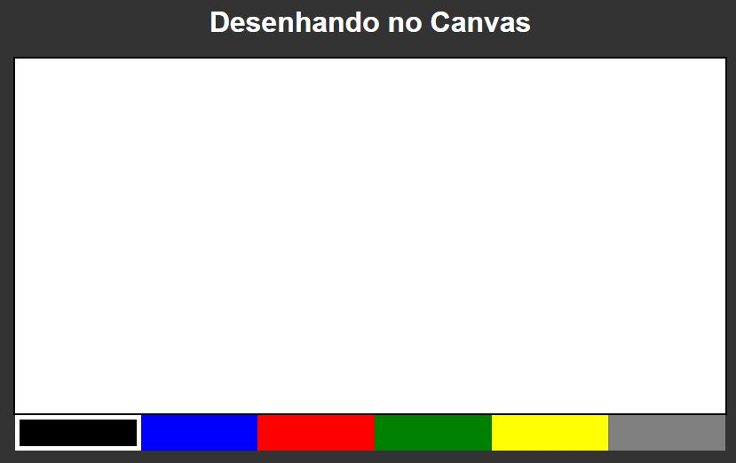

# Projeto-Quadro-de-desenho

<h2>Conhecimentos obtidos com o projeto</h2>

<ul>
    <li>Manipulação do DOM. </li>
    <li>Utilização da tag <b>canvas</b>. </li>
    <li>Eventos de mouse. </li>
    <li>Pegar posição do ponteiro do mouse na tela e compensar com base nas medidas do elemento. </li>
</ul>
<b> Descrição:</b>  
Este projeto possibilita que o usuário escreva algo ou faça desenhos utilizando o click e araste do mouse.  
<h2>Captura de tela do projeto:</h2>

